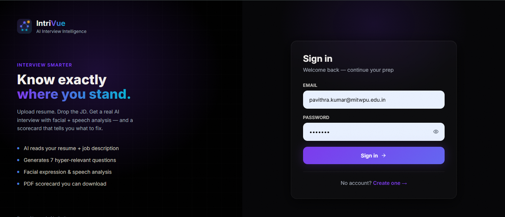
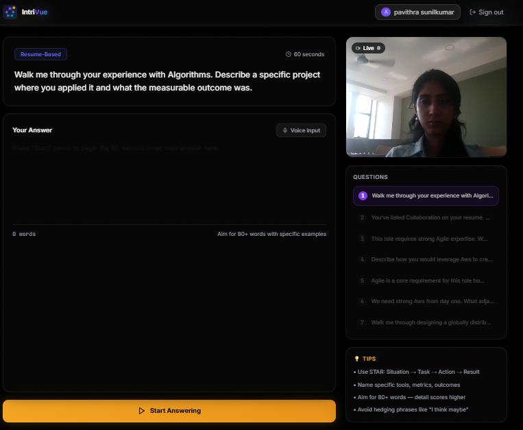
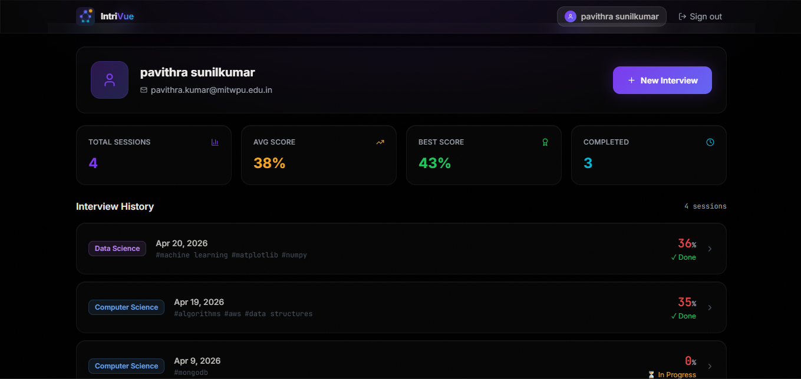
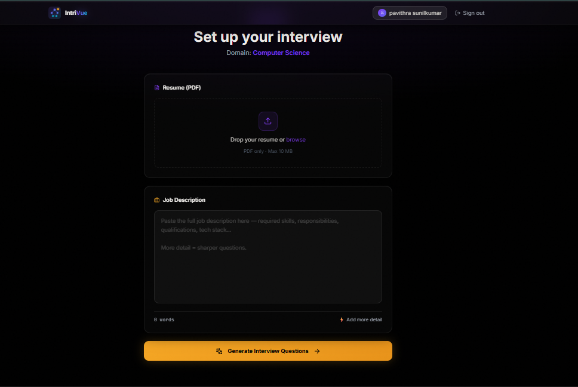

# IntriVue — AI Interview Intelligence Platform


---

## 🧠 Description

**IntriVue ** is a full-stack AI-powered mock interview platform that simulates real interviews using NLP and ML.
It generates personalized questions, evaluates responses, and provides detailed performance insights.

---

## 📸 Screenshots

### 🔐 Login Page



### 🎤 Interview Interface



### 📊 Results Dashboard



### 📑 resume and jd selection



---

## ⚡ Features

* Resume-based question generation
* Skill gap detection
* Voice + webcam recording
* Semantic answer evaluation
* Performance dashboard
* PDF report generation

---

## ⚡ Quick Start

```bash
# Backend
cd backend
npm install
npm run dev

# AI Service
cd ai-service
venv\Scripts\activate
pip install -r requirements.txt
python main.py

# Frontend
cd frontend
npm install
npm run dev
```

Open http://localhost:3000

---

## 🏗️ Tech Stack

Frontend: React, Vite, Tailwind
Backend: Node.js, Express, MongoDB
AI: FastAPI, Sentence Transformers

---

## ⚠️ License

This project is for **educational and personal use only**.
Commercial usage is strictly prohibited.

---
