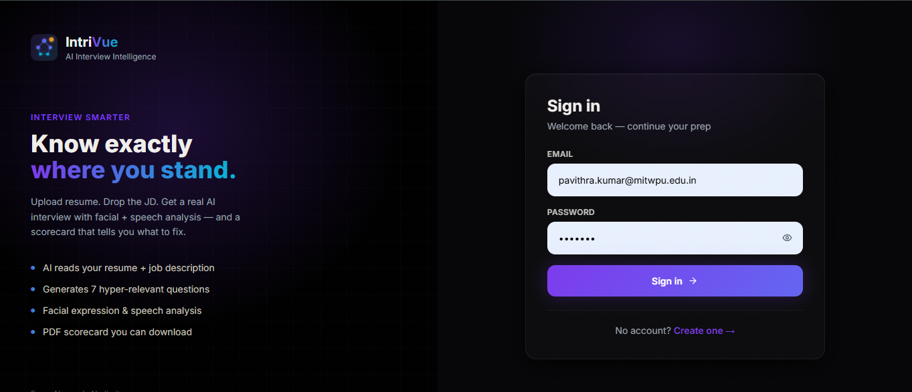
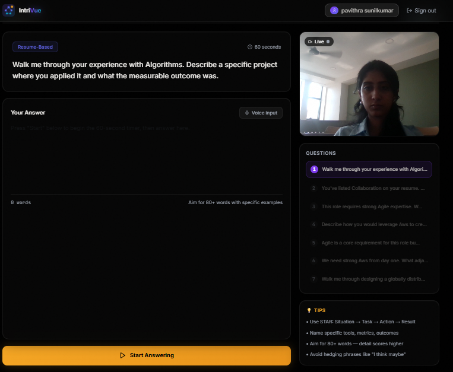
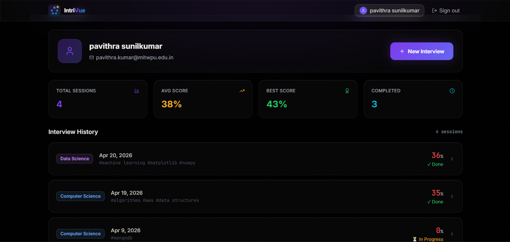
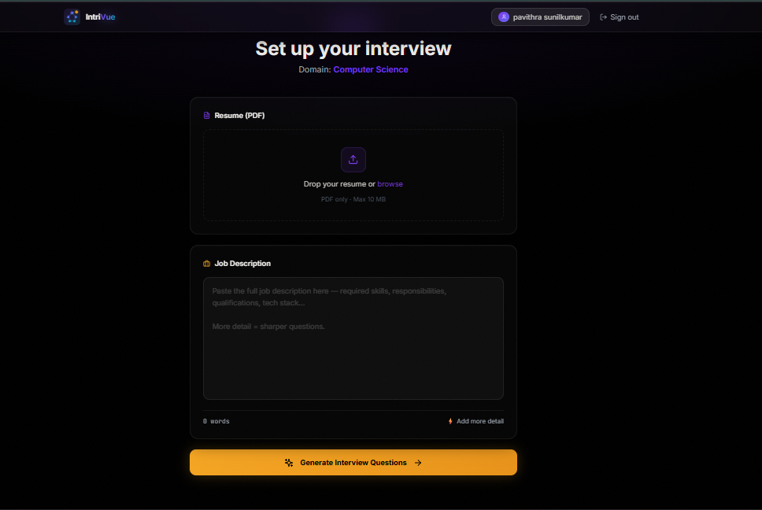

# IntriVue —  AI Interview Intelligence Platform 

🌐 Live Deployment-[ Visit InHire](https://in-hire.vercel.app/login)


---

IntriVue is an intelligent AI-powered platform designed to enhance the interview preparation and job discovery experience personalised for you.

The platform combines:

AI-based interview simulation
Resume and job description analysis
Personalized opportunity recommendations
Smart candidate evaluation
Interactive modern UI/UX

It helps users prepare smarter, identify skill gaps, and discover relevant opportunities through intelligent matching systems.

# ✨ Features

## 🤖 AI Interview System
- Dynamic AI-generated interview questions
- Domain-specific interview preparation
- Technical and behavioral question generation
- Real-time interaction flow

## 📄 Resume Analysis
- Resume parsing and evaluation
- Skill extraction and matching
- ATS-friendly analysis
- Resume vs Job Description comparison

## 🎯 Smart Opportunity Matching
- Personalized recommendation engine
- Skill-based opportunity discovery
- Intelligent ranking system
- Swipe-based exploration experience

## 📊 Candidate Insights
- Performance evaluation metrics
- Strength and weakness analysis
- Improvement recommendations
- Smart feedback generation

## 🎨 Modern User Experience
- Responsive UI design
- Interactive dashboard
- Clean mobile-inspired interface
- Smooth user navigation

---

## 📸 Screenshots

### 🔐 Login Page



### 🎤 Interview Interface



### 📊 Results Dashboard



### 📑 resume and jd selection



---


## ⚡ Quick Start

```bash
# Backend
cd backend
npm install
npm run dev

# AI Service
cd ai-service
venv\Scripts\activate
pip install -r requirements.txt
python main.py

# Frontend
cd frontend
npm install
npm run dev
```

# 🧠 Core AI Concepts Used

- Natural Language Processing (NLP)
- Resume Skill Extraction
- Recommendation Systems
- Content-Based Filtering
- Semantic Matching
- AI Prompt Engineering
- Candidate Scoring Algorithms

---

# 📂 Project Structure

```bash
IntriVue/
│
├── frontend/
│   ├── components/
│   ├── pages/
│   ├── assets/
│   └── services/
│
├── backend/
│   ├── api/
│   ├── models/
│   ├── recommendation_engine/
│   └── interview_system/
│
├── datasets/
├── screenshots/
└── README.md
```

---
# 🔮 Future Enhancements

- Voice-based AI interviews
- Real-time interview scoring
- AI-generated resume improvements
- LLM-powered conversational interviews
- Multi-role recommendation system
- Analytics dashboard for recruiters

---

# 👩‍💻 Author

## Pavithra S

- LinkedIn: https://linkedin.com/in/pavithra-sunilkumar68
- GitHub: https://github.com/pavithrasunilkumar
- Portfolio: https://vermillion-panda-a08876.netlify.app/

---

# ⭐ Support

If you found this project useful, consider giving it a ⭐ on GitHub.

---

## ⚠️ License

This project is for **educational and personal use only**.
Commercial usage is strictly prohibited.

---
